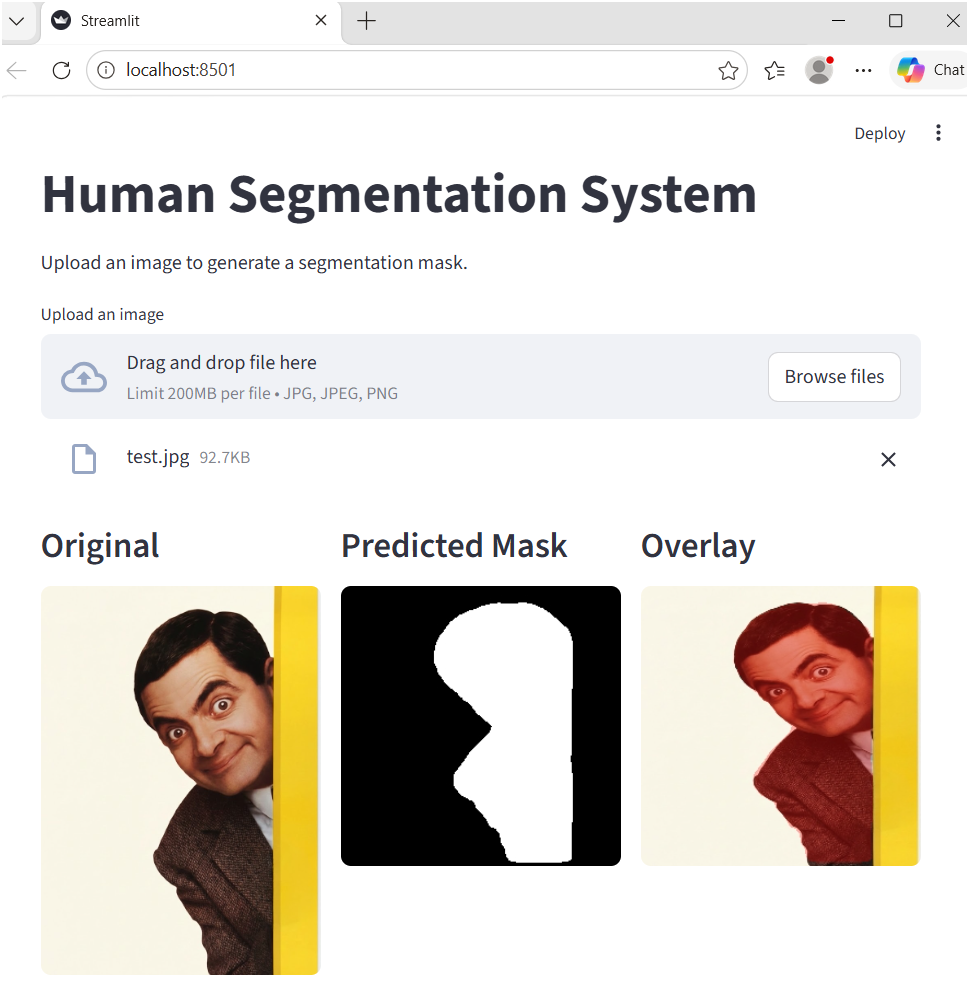
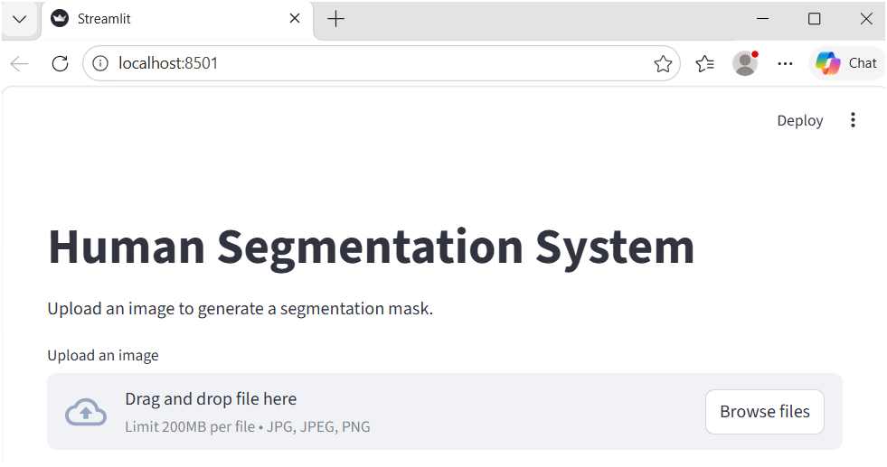

# Human Segmentation System

A deep learning project that segments humans from images and generates a pixel-wise binary mask using a U-Net style encoder-decoder architecture with a MobileNetV3 backbone.



---

## Project Structure

```
Human_Segmentation_System/
├── src/
│   ├── config.py       # IMG_SIZE and MODEL_PATH constants
│   ├── model.py        # U-Net model definition
│   └── inference.py    # Run inference from command line
├── notebooks/
│   └── Train_colab.ipynb   # Colab training notebook (GPU)
├── weights/
│   └── model.keras     # Trained model (place here after Colab training)
├── assets/             # Sample test images
├── app.py              # Streamlit web app
└── requirements.txt
```

---

## Model Architecture

- Encoder–Decoder (U-Net style)
- Encoder: MobileNetV3 (pretrained on ImageNet)
- Decoder: Convolution + upsampling blocks with skip connections
- Output: 1-channel binary mask with sigmoid activation
- Dataset:COCO 2017 (person class, 10,000 samples), trained on Google Colab

---

## Setup

```bash
pip install -r requirements.txt
```

Place trained `model.keras` in the `weights/` folder.

---

## Run the Streamlit App

```bash
streamlit run app.py
```

Upload an image — the app shows the original, predicted mask, and overlay side by side.



---


## Tech Stack

Python, TensorFlow/Keras, OpenCV, NumPy, Streamlit, Google Colab (for training) 

## Results

The system generates a pixel-wise segmentation mask for the input image, which can be visualized directly or overlaid on the original image using the Streamlit app.

### Segmentation Result Example
